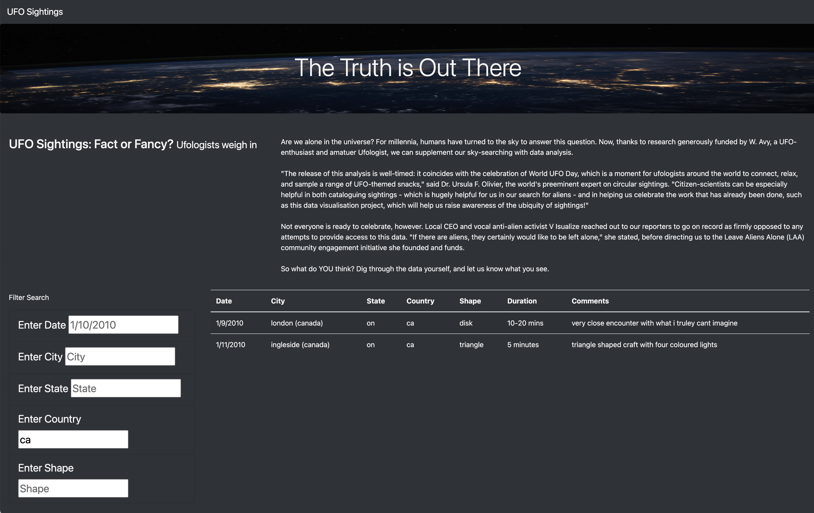

# UFO Sightings with Javascript

## Overview of Project: 

In this project, we will create a table to organize UFO data that is stored as a JavaScript array, or list. To better interact with users in the webpage, we will use JavaScript by looking into its technical aspects and how it applies to the field of data analytics and visualization. Specifically, to provide a more in-depth analysis of UFO sightings by allowing users to filter for multiple criteria at the same time rather than the date, this challange provides more table filters such as the city, state, country, and shape. These additional filters to make this table fully dynamic, meaning that it will react to user input, and then place the table into an HTML file for easy viewing.

**JavaScript introduction: Javascript is not related to Java. It is a well-established coding language that was designed to enhance HTML. It's the backbone of many popular visualization libraries, such as Plotly, and is often used to create custom dashboards. JavaScript also provides a high level of customization: the dashboards built to deliver visual data, such as maps or graphs, can be as simple or complex as needed.

In this challange, we'll need to apply your HTML and Bootstrap skills and have an open mind regarding semicolons.

## Results: Describe to Dana how someone might use the new webpage by walking her through the process of using the search criteria. Use images of your webpage during the filtering process to support your explanation.

On the filter tab of the webpage, we could easily enter any of the criteria we want to filter. The filter allows users to use multiple criterias rather than one! As the 1st picture below, it provides an example that we filtered both date and city.

- filter the date of 1/13/2010 and the city of Ackerman

- filter the date of 1/13/2010

- filter the country of Canada

- filter the sate of California

- filter the city of Bonita

- filter the shape of light

## Summary: In a summary statement, describe one drawback of this new design and two recommendations for further development.

- The summary addresses one drawback of this webpage
 - This webpage is based on a local path link rather than a true website. Thus, we are not able to share it with people. 
 - All filter criterias are based on a specific format and case sensitive.
 - Users are not able to find details, meaning that there are no additional webpage links to this main webpage.
- The summary addresses two additional recommendations for further development
 - Change the local based webpage to the internet, allowing people enter this webpage.
 - Add both lower case and upper case for reseach filters allows users to use both letter.
 - Provide additional webpage linking to filter criterias. e.g. we may link the city to the google map which allows users identify the address.
